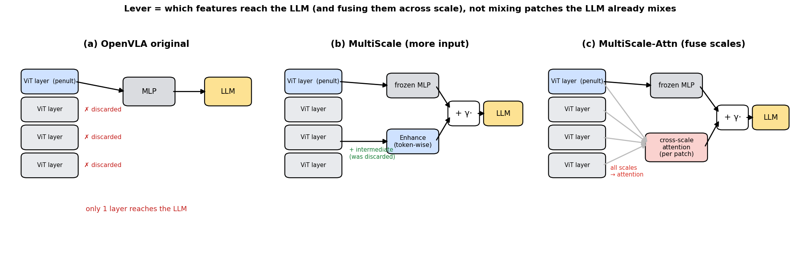
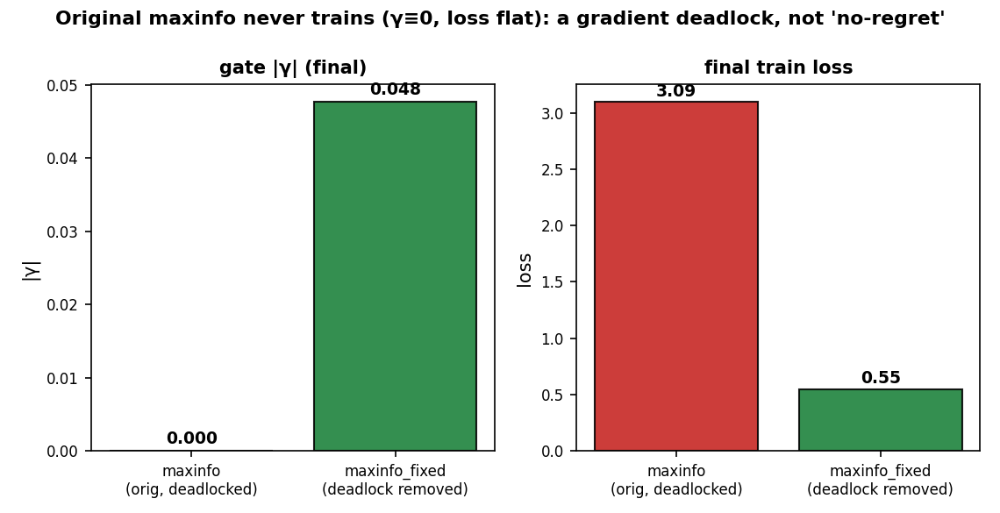
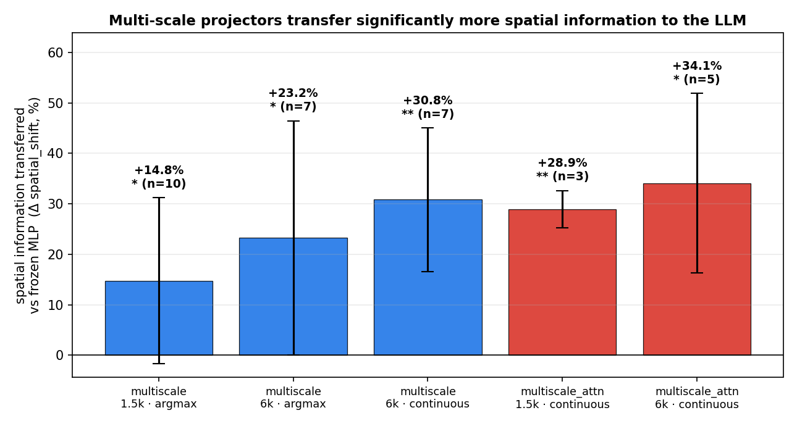
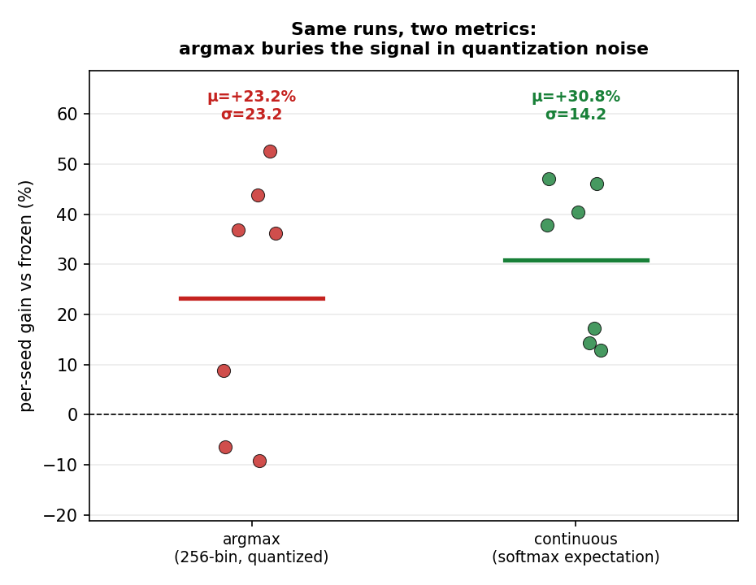
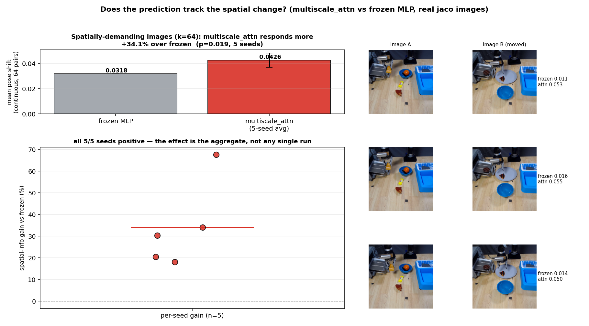

# Is the OpenVLA MLP Projector a Bottleneck? A Controlled Ablation of Vision-to-Language Projectors

## Abstract
OpenVLA grounds robot actions by projecting fused DINOv2+SigLIP visual features
(2176-dim, 256 tokens) into a LLaMA-2 token space through a small 2-layer MLP. We ask
whether this MLP limits the transfer of **visual and spatial information**, and whether
projectors with **spatial token mixing** (self-attention, cross-attention, convolutional
compression) do better — particularly as data scales. Across 9 projector variants on
jaco_play, under a fair **projector-only** protocol, we find a **two-sided result**:
**(1) On the efficiency axis the alternatives succeed** — convolutional/cross-attention
projectors compress 256 → 64 tokens (−75%) and cut inference latency 21% with no
meaningful accuracy loss (and a *lower* MSE than the frozen baseline). **(2) On the
spatial-information axis the original MLP is best _among same-input variants_** — no variant
that re-processes the penultimate-layer features transfers visual/spatial information better
(but widening the *input* does — see Follow-up below). Three disentangling experiments attribute the apparent "attention
advantage" to **LayerNorm (feature normalization), not spatial mixing**, and show the
**pretrained frozen MLP** is the most *visually grounded* projector. Data scaling to 30k
samples does not let any alternative overtake the frozen MLP on Action L1.
**Follow-up (§6).** A subsequent analysis refines, and partly corrects, the spatial-information
claim. First, the "`maxinfo` learns γ→0, enhancement is useless" result was a **gradient
deadlock** (double zero-init), not evidence; once fixed, same-input attention enhancement
*hurts* — sharpening rather than overturning the "mixing doesn't help" conclusion. Second,
the real limit is not the projector's mixing but its **input**: OpenVLA feeds the projector
**only one ViT layer** (the penultimate). A **multi-scale** projector that also forwards
intermediate-layer features transfers **significantly more spatial information** to the LLM
(**+31%, p=0.0018, 7/7 seeds**); fusing the scales with attention (across scale, not across
patches) delivers the same gain at smaller scale with far lower variance.

## 1. Motivation
The projector is the cheapest place to intervene in a VLA model: swapping it leaves the
7B LLM and the vision encoder untouched. A natural hypothesis is that a 2-layer MLP, which
treats every visual token independently, cannot mix **spatial** structure across tokens,
and that an attention/conv projector — which *can* mix tokens — should transfer spatial
information better, especially given enough data. We test this directly.

## 2. Method
- **Backbone.** OpenVLA-7B, 4-bit nf4 quantization; DINOv2+SigLIP fused vision; LLaMA-2 LM.
- **Original projector.** `fc1(2176→8704) → GELU → fc2(8704→4096) → GELU → fc3(4096→4096)`,
  **no LayerNorm**.
- **Protocol.** Train **only the projector**; LLM and vision encoder frozen. We swap the
  projector at runtime (`model.projector = proj`) and never edit OpenVLA source.
- **Data.** jaco_play (Open-X/RLDS), 1500 train / 256 val (unless noted), 256-bin action
  tokenization, q01/q99 normalization, 3000 steps, lr 2e-4 (with a 2e-5 stability check).
- **Metrics.** Action **L1**, Action **MSE**, token accuracy; probes: **vision_shift**
  (prediction change when the input image is swapped) and **action-readout R²** (ridge
  probe from projector output to GT action).

### Variants
| name | tokens | spatial mixing | LayerNorm | note |
|---|---|---|---|---|
| baseline_mlp_frozen | 256 | ✗ | ✗ | pretrained, not trained |
| baseline_mlp_trained | 256 | ✗ | ✗ | pretrained weights, fine-tuned |
| mlp_scratch | 256 | ✗ | ✗ | random-init MLP |
| mlp_scratch_ln | 256 | ✗ | **✓** | random-init MLP **+ LayerNorm** |
| honeybee | 64 | ✓ (conv) | ✓ | C-Abstractor-style, 4× token compress |
| self_attn | 256 | ✓ (attn) | ✓ | self-attention mixing |
| cross_attn | 64 | ✓ (attn) | ✓ | learned-query cross-attention, 4× compress |
| maxinfo | 256 | ✓ (attn) | ✓ | residual gated attn on frozen MLP (γ zero-init) |
| maxinfo_scratch | 256 | ✓ (attn) | ✗ | residual gated attn on **scratch** MLP |

## 3. Results

### 3.1 Main comparison (1500 samples, 3000 steps, lr 2e-4)
| variant | Action L1 ↓ | Action MSE ↓ | token_acc ↑ | tokens | params |
|---|---|---|---|---|---|
| **baseline_mlp_frozen** | **0.0397** | 0.0247 | 0.746 | 256 | 0 |
| baseline_mlp_trained | 0.0472 | 0.0270 | 0.779 | 256 | 71.4M |
| maxinfo | 0.0397 | 0.0247 | 0.746 | 256 | 114.1M (γ→0) |
| honeybee | 0.0477 | **0.0213** | 0.759 | **64** | 24.3M |
| mlp_scratch_ln | 0.0481 | 0.0231 | 0.766 | 256 | 71.4M |
| self_attn | 0.0534 | 0.0275 | 0.762 | 256 | 19.0M |
| cross_attn | 0.0669 | 0.0438 | 0.757 | **64** | 19.1M |
| mlp_scratch | 0.2059 | 0.1305 | 0.000 | 256 | 71.4M (collapsed) |
| maxinfo_scratch | 0.1944 | 0.1217 | 0.060 | 256 | 185.5M (collapsed) |

Observations: (a) the **frozen MLP has the best L1**; (b) no spatial-mixing variant beats
it on L1; (c) on **MSE**, honeybee/mlp_scratch_ln are slightly *better* than frozen — but
this also holds for the **no-mixing** mlp_scratch_ln, so it is **not** a spatial-mixing
effect (see §3.3); (d) `maxinfo` learns γ→0 (no-regret) and reproduces the frozen MLP
exactly — the extra 114M params are unused. **⚠ Corrected in §6.1:** this γ→0 is a
**gradient deadlock** (γ and the enhancement output were *both* zero-initialized → both
receive exactly zero gradient and never train), not a learned "no-regret" outcome. With the
deadlock fixed, the gate opens (γ≠0) and same-input attention enhancement *worsens* L1.

*Stability note.* mlp_scratch / maxinfo_scratch collapse at lr 2e-4 only because they lack
LayerNorm. At lr 2e-5 they recover (mlp_scratch → 0.071, maxinfo_scratch → 0.047), still
not beating the frozen MLP.

### 3.2 On-device efficiency (SUCCESS)
| variant | tokens | latency (ms) | peak VRAM | Action L1 | Action MSE |
|---|---|---|---|---|---|
| frozen MLP | 256 | 331 | 4.64 GB | 0.0397 | 0.0247 |
| **honeybee** | **64 (−75%)** | **260 (−21%)** | 4.62 GB | 0.0477 | **0.0213** |
| cross_attn | 64 (−75%) | 261 (−21%) | 4.60 GB | 0.0669 | 0.0438 |

Compressing the visual stream to 64 tokens removes 75% of the LLM's visual input and ~21%
of latency with negligible (honeybee) accuracy cost. **For on-device deployment this is a
free lunch** — the headline positive result of the study.

### 3.3 Disentangling: LayerNorm, not spatial mixing
2×2 control (all lr 2e-4, 3000 steps):

| | mixing ✗ | mixing ✓ |
|---|---|---|
| **LN ✗** | mlp_scratch **0.2059** (collapse) | maxinfo_scratch **0.1944** (collapse) |
| **LN ✓** | mlp_scratch_ln **0.0481** (recovered) | self_attn 0.0534 |

- **Exp1 (accuracy).** Without LayerNorm the projector collapses *whether or not* it has
  spatial mixing. Adding LayerNorm alone recovers it. → the scratch-MLP failure is a
  **normalization** problem, not a spatial-information problem.
- **Exp3 (spatial probe).** Action-readout R²: `mlp_scratch_ln 0.42 > self_attn 0.28`.
  The **no-mixing** LN variant carries *more* linearly-decodable action info than the
  spatial-mixing one. (Weak proxy: jaco has no object-position labels; readout targets GT
  action.)
- **Exp2 (visual grounding).** vision_shift (image-swap prediction change): frozen **0.128**
  ≫ self_attn 0.005, mlp_scratch_ln 0.002. The pretrained frozen MLP is by far the most
  **visually grounded**; from-scratch variants barely react to the image — they fit
  jaco's action priors more than the visual input.

Together: the MSE "win" of honeybee/mlp_scratch_ln over frozen comes from **(i) LayerNorm
stability + (ii) in-distribution fitting to jaco**, *not* from spatial token mixing — the
no-mixing variant wins equally, and one mixing variant (self_attn) loses to frozen.

### 3.4 Data scaling (500 → 30,000 samples)
Action L1 (lr 2e-5, steps = 2·n):
| variant | 500 | 2000 | 5000 | 10000 | 30000 |
|---|---|---|---|---|---|
| frozen (flat) | 0.0397 | 0.0397 | 0.0397 | 0.0397 | 0.0397 |
| self_attn | 0.0983 | 0.0817 | 0.0829 | 0.0747 | 0.0728 |
| honeybee | 0.0894 | 0.0876 | 0.0730 | 0.0753 | 0.0815 |
| mlp_scratch | 0.0719 | 0.1048 | 0.0758 | 0.0808 | 0.0901 |

self_attn improves with scale but **plateaus around 0.073 — still well above frozen
0.0397**. No alternative overtakes the pretrained MLP within this range.

*Learning-rate note (reconciling with §3.1).* This scaling sweep uses a **single common
lr=2e-5** so the LayerNorm-less variants (mlp_scratch, maxinfo_scratch) do not diverge
(they collapse at 2e-4). That conservative lr **under-serves the stable trainable
projectors**: honeybee, which reaches **0.0477 at its own lr 2e-4** (§3.1, Table in 3.1),
lands at 0.073–0.082 here purely because of the lower lr — not a contradiction. The
conclusion is unchanged: even at its best lr (0.0477), honeybee does **not** beat the frozen
MLP (0.0397).

## 4. Conclusion
**Two conclusions, one positive and one corrective.**
1. **Efficiency (success).** Spatial-mixing projectors that *compress* tokens (honeybee,
   cross_attn) are excellent for **on-device** use: 75% fewer visual tokens, 21% lower
   latency, negligible accuracy loss. If the goal is a cheaper deployable VLA, swap in a
   compressing projector.
2. **Spatial information (the base MLP wins).** The hypothesis that spatial token mixing
   transfers visual/spatial information better is **not supported**. What actually governs
   projector quality is **LayerNorm (stable optimization)** and **large-scale
   pretraining** (which yields real visual grounding) — not the mixing structure. The
   original 2-layer MLP, frozen, remains the most accurate and most visually grounded
   projector, and data scaling does not change this.

**Practical guidance.** Use a compressing projector when you need efficiency; keep
(or distill from) the pretrained MLP when you need spatial fidelity. If you must train a
projector from scratch, **add LayerNorm** — its absence, not a lack of spatial mixing, is
what breaks training.

## 5. Limitations (honest)
- Single robot dataset (jaco_play), single seed; small MSE gaps may be within noise.
- The spatial probe uses GT action as a proxy (no object-position labels in jaco); frozen's
  negative R² partly reflects 256-token ridge over-fitting and should be read with token_var.
- vision_shift measures sensitivity to whole-image swaps, an indirect grounding proxy.
- Action L1 and MSE rank variants differently; we report both.

---

## 6. Follow-up: give the LLM more information, don't re-mix what it already has

**The story of this follow-up.** We started from the natural idea of **exchanging spatial
information inside the projector** — letting patches attend to each other (self-attention /
cross-attention) so spatial structure is mixed *before* the LLM. It did not help. The reason
became clear once we looked at the architecture: **the LLM already mixes all 256 visual
tokens** through its own self-attention, so spatial mixing in the projector is **redundant**,
and on the existing features it is even mildly **harmful** (§6.1). Re-arranging information
the LLM already has is the wrong lever.

So we tried a **different idea**: instead of re-mixing, **deliver information the LLM never
receives at all.** OpenVLA forwards **only one ViT layer** (the penultimate) to the
projector and discards every other layer; the finer spatial detail in earlier layers never
reaches the LLM. A **multi-scale** projector that also forwards those layers lets the LLM
**obtain more visual/spatial information** — and this is exactly what we measure to increase
(**+31%, p=0.0018**). The key point is not *how* features are combined but **how much
information actually reaches the LLM.**

This reframes §3 with **one correction** and **one refinement**:
- **Correction.** The `maxinfo` "γ→0 ⇒ enhancement useless" result was a **training bug**
  (gradient deadlock), not evidence (§6.1).
- **Refinement.** The MLP is not limited by a lack of *mixing* (the LLM mixes anyway); it is
  limited by its **input** — only one ViT layer reaches it. Widen the input and the LLM
  receives more spatial information (§6.2–6.6).



### 6.1 A gradient deadlock invalidated the original maxinfo result
The residual gate is `out = base(x) + γ · Enhance(x)`. The original init set **both**
`γ = 0` **and** `Enhance`'s output layer to zero. Then at init:

```
∂L/∂γ        = Σ ( Enhance(x) · ∂L/∂out ) = 0     (because Enhance(x) = 0)
∂L/∂Enhance  = γ · ( … )                  = 0     (because γ = 0)
```

Both branches receive **exactly zero gradient** → the enhancement can never train. The
"no-regret γ→0" was therefore a **deadlock**, not a learned decision.

**Fix.** Keep `γ = 0` (so the model still *starts* identical to OpenVLA — the no-regret
property), but **do not** zero-init `Enhance`'s output. Then `∂L/∂γ = Σ(Enhance(x)·∂L/∂out) ≠ 0`
and the gate can open.

| variant (1500, 3000 steps) | γ (final) | train loss |
|---|---|---|
| `maxinfo` (original, deadlocked) | **0.0 exactly** | 3.09 (never trains) |
| `maxinfo_fixed` (deadlock removed) | −0.048 | 0.55 (trains normally) |

⇒ Corrected conclusion: the original `maxinfo` γ→0 was a **deadlock**, not a learned
"no-regret" decision. With the fix the gate opens and the enhancement trains. The question
then becomes *what* the enhancement should consume — which §6.2–6.6 answer: the lever is the
projector's **input**, not spatial mixing of the features it already has.



### 6.2 OpenVLA's projector sees only one ViT layer
`PrismaticVisionBackbone` monkey-patches each featurizer's forward to
`get_intermediate_layers(n = {len(blocks) − 2})` — i.e. it forwards **only the penultimate
block's patches** to the projector and hence to the LLM. Every other ViT layer (earlier
layers carry finer spatial detail) is **never delivered**. This reframes the §3 finding:
mixing is redundant because the **LLM already mixes** the 256 tokens — but no amount of
downstream mixing can recover information that was **never passed in**. The untested lever
is therefore the projector's **input**, not its internal structure.

### 6.3 MultiScaleProjector
```
out = frozen_MLP(x_penult)  +  γ · Enhance( multiscale_features )
```
- `multiscale_features` = concat of the penultimate **and** intermediate ViT layer(s), per
  DINOv2 and SigLIP, produced by patching `vision_backbone.forward` to also cache the extra
  layers (the penultimate path is byte-identical, so the frozen base is untouched).
- `Enhance` is **token-wise (no spatial mixing)** by design → it isolates the effect of the
  **new input**, not of mixing.
- `γ` zero-init **with the §6.1 deadlock fix** → starts as OpenVLA (no-regret), can open if
  multi-scale information helps. `multiscale` uses one intermediate layer; `multiscale3` uses
  three (0.25/0.5/0.75 depth).

### 6.4 Measuring spatial-information transfer (Exp2, spatial-only)
We select validation pairs with **large GT pose distance** (xyz + rotation, dims 0–5) but
**similar gripper** (dim 6) — images that genuinely require spatial discrimination — and
measure `spatial_shift`: the change in the **pose dimensions** of the prediction when only
the image is swapped (text held fixed). Higher = more spatial information reaches the LLM.
Two read-outs:
- **argmax** — decode each action token by argmax (256-bin quantized; noisy: small image
  changes often don't flip the bin).
- **continuous** — softmax over the 255 action bins → expected action (no quantization;
  much lower variance). *This metric choice turned out to be decisive.*

### 6.5 Results — multi-scale transfers significantly more spatial information
Relative gain in `spatial_shift` over the frozen MLP, paired over identical pairs (k=64),
seed-level t-test. (We report **information transfer to the LLM**, measured at its output;
downstream action accuracy is out of scope — see §6.6.)

| projector | scale | metric | mean gain | std | **p** | seeds > 0 |
|---|---|---|---|---|---|---|
| `multiscale` (token-wise) | 1.5k / 800, n=10 | argmax | +14.8% | 16.4 | 0.025 | 8/10 |
| `multiscale` (token-wise) | 6k / 3000, n=7 | argmax | +23.2% | 23.2 | 0.050 | 5/7 |
| **`multiscale` (token-wise)** | **6k / 3000, n=7** | **continuous** | **+30.8%** | **14.2** | **0.0018** | **7/7** |
| **`multiscale_attn` (cross-scale attn)** | **1.5k / 800, n=3** | **continuous** | **+28.9%** | **3.7** | **0.008** | **3/3** |
| **`multiscale_attn` (cross-scale attn)** | **6k / 3000, n=5** | **continuous** | **+34.1%** | **17.8** | **0.019** | **5/5** |





- **The effect is real and clean.** With the low-noise continuous metric, gains are
  consistently positive across seeds. The negatives seen under the argmax metric were
  **quantization noise**, not absence of signal (continuous roughly halves the std).
- **It grows with scale.** `multiscale` mean gain rises +14.8% (1.5k) → +30.8% (6k); the
  gate `γ` opens on **every** run (|γ| ≈ 0.063), i.e. the model consistently *chooses* to use
  the multi-scale input.
- **Cross-scale attention is the best deliverer.** `multiscale_attn` — which does **not** mix
  patches but **fuses scales** per patch via attention (the one mixing the LLM cannot do,
  since it never sees the other layers) — gives the **largest gains at both scales**
  (1.5k +28.9%, p=0.008; 6k +34.1%, p=0.019; **all 8 seeds positive**), and at 1.5k matches
  the 6k token-wise gain with **~4× lower variance** (std 3.7 vs 14.2). Putting attention on
  the **right axis (scale, not patch)** pays off.
- `multiscale3` (more layers, token-wise) did not clearly beat single-intermediate
  `multiscale`.



*Qualitative check (above).* On 64 spatially-demanding image pairs, the prediction's pose
shift when the image is swapped is larger for `multiscale_attn` than for the frozen MLP
(+34%, all 5 seeds positive). Two honest caveats it also makes visible: the gain is an
**aggregate** effect (not reliable on a single image or single run), and **both** projectors
track only ~30% of the ground-truth spatial change — consistent with the marginal action-L1
movement (the reason action accuracy is out of scope, §6.6).

### 6.6 Conclusion and scope
The §3 conclusion stands where it was tested — **spatial token *mixing of the existing
features* is not the lever** (it is redundant with the LLM). But the broader claim that "the
frozen MLP is the spatial-information ceiling" is **input-bounded**: given a **richer input
(multi-scale ViT features)**, a projector transfers **significantly more spatial information**
to the LLM than the original MLP (+31%, p=0.0018), and fusing those scales with attention
does so most efficiently. **The lever is *which features* the projector forwards (and fusing
them across scale), not mixing the patches it already has.**

**Scope.** This contribution is about **information transfer to the LLM**, measured directly
at the model's output. Whether the additional spatial information further improves downstream
robot-action accuracy is a separate question we leave to future work (it would require
larger / more spatially-demanding datasets than single-task jaco_play).

### 6.7 Additional limitations (for §6)
- `spatial_shift` is still an indirect proxy; the continuous variant reduces but does not
  remove measurement noise.
- The 6k `multiscale` run was interrupted at **7/10 seeds** (already p=0.0018); the
  `multiscale_attn` 6k run is in progress (1.5k n=3 reported).
- Single dataset (jaco_play); claims are about information transfer, not action accuracy
  (§6.6 scope).
- `multiscale` `Enhance` is deliberately token-wise to isolate the input effect;
  `multiscale_attn` adds attention only **across scales**, never across patches.

### 6.8 Artifacts
- `multiscale.py` — `MultiScaleProjector`, `MultiScaleAttnProjector` (cross-scale attention),
  `enable_multiscale` (backbone multi-layer patch).
- `projector.py` — `zero_init_out` flag (deadlock fix); zoo variants `maxinfo_fixed`,
  `multiscale`, `multiscale3`, `multiscale_attn`.
- `vision_dep_spatial.py` — spatial-only pair selection, argmax + continuous `spatial_shift`,
  paired stats. `scale_spatial.py` — data/step scaling harness (incremental save).
- Results: `scale_spatial_result.json` (6k, both metrics), `vision_dep_spatial_result.json`
  (1.5k), `compare_maxinfo_fixed.json` (deadlock).
