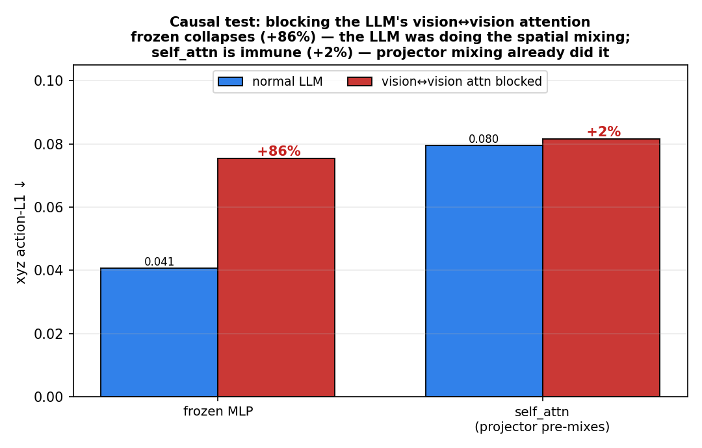
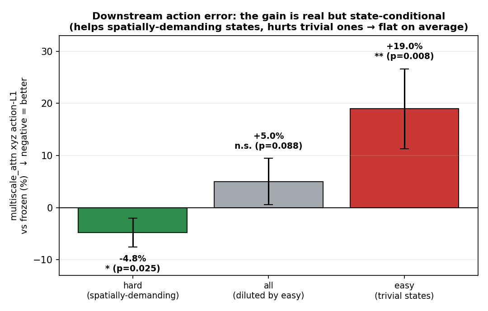

# Rethinking Visual Information Transfer in the OpenVLA Projector

> **On-device efficiency of token compression, and multi-scale information delivery.**
> A controlled study of the projector in [OpenVLA](https://github.com/openvla/openvla):
> does the simple 2-layer MLP bottleneck visual/spatial information, and what actually helps?

Projector-only fine-tuning on `jaco_play` (Open-X), with the LLM and vision encoder frozen.
We never modify OpenVLA source — the projector is swapped at runtime.

---

## TL;DR

1. **Token compression is a free lunch (on-device).** A compressing projector (honeybee)
   cuts visual tokens 256→64 (−75%) and latency 331→260 ms (−21%) with negligible accuracy loss.
2. **Spatial token *mixing* is not the lever.** Adding attention/conv inside the projector does
   not help — because the **LLM's self-attention already integrates the 256 visual tokens**.
   We prove this **causally**: blocking the LLM's vision↔vision attention collapses the frozen
   MLP (+86%) but barely touches a projector that pre-mixes (+2%).
3. **The real lever is the projector's *input*.** OpenVLA forwards only the **penultimate ViT
   layer**; the rest is discarded. A **multi-scale** projector that also delivers earlier
   layers transfers **significantly more spatial information to the LLM** — **+31%**
   (token-wise, p=0.0018) and **+34%** (cross-scale attention, p=0.019), all seeds positive.
   This converts to lower action error **on spatially-demanding states** (−4.8%, p=0.025),
   though it is state-conditional (slightly hurts trivial states).

Bonus correction: the residual-gate "γ→0 ⇒ enhancement useless" result was a **gradient
deadlock** (double zero-init), not evidence — fixed via `zero_init_out=False`.

---

## Key figures

| | |
|---|---|
| **The lever is the input, not mixing** |  |
| **Multi-scale transfers more spatial info** (+31% / +34%) |  |
| **Causal: the LLM does the spatial mixing** (block → frozen +86%, self_attn +2%) |  |
| **Downstream: state-conditional gain** (hard −4.8%, easy +19%) |  |

(Korean versions of the paper figures: `figs/ms6_ko.png`, `figs/ms7_ko.png`, `figs/fig_scratch_ko.png`.)

---

## Read

- **[PAPER.md](PAPER.md)** — full paper draft (motivation → method → results → conclusion, §6 = multi-scale follow-up)
- **[FOLLOWUP_STUDY.md](FOLLOWUP_STUDY.md)** — this session's experiments + critique responses (causal/observational/downstream)
- Supporting notes: [RESULTS.md](RESULTS.md) · [DISENTANGLE_RESULTS.md](DISENTANGLE_RESULTS.md) · [INFERENCE_EFFICIENCY.md](INFERENCE_EFFICIENCY.md) · [SCALING_RESULTS.md](SCALING_RESULTS.md) · [CONCLUSION.md](CONCLUSION.md) · [HANDOFF.md](HANDOFF.md)

## Code map

| file | purpose |
|---|---|
| `projectors_zoo.py` | all projector variants (frozen/trained MLP, honeybee, self/cross-attn, maxinfo(_fixed), **multiscale(3), multiscale_attn**) |
| `projector.py` | residual-gate projector + `zero_init_out` (deadlock fix) |
| `multiscale.py` | **`MultiScaleProjector`, `MultiScaleAttnProjector`**, `enable_multiscale` (backbone multi-layer patch) |
| `train_eval.py` | training/eval harness (Action L1/MSE, token acc) |
| `vision_dep_spatial.py` | spatial-info transfer probe (argmax + continuous `spatial_shift`, paired stats) |
| `scale_spatial.py` | data/step scaling harness |
| `spatial_action.py` | downstream action-L1 on spatially-demanding vs trivial states |
| `llm_attn_ablation.py` | **causal** test — block LLM vision↔vision attention (manual 4D mask) |
| `attn_map_analysis.py` | **observational** — per-layer vision→vision attention mass |
| `make_*figures*.py` | figure generators (`make_multiscale_figures.py`, `make_critique_figures.py`, `make_korean_figures.py`, …) |
| `data.py` | `load_jaco_subset` (Open-X / RLDS) |
| `results: *.json` | all measured numbers backing the figures/tables |

## Reproduce
Requires an OpenVLA-7B checkpoint + `jaco_play` (Open-X) locally; run from the OpenVLA repo root with this folder available.
```bash
python train_eval.py                         # main projector comparison
python scale_spatial.py --variant multiscale_attn --tag d6k_attn \
    --train_n 6000 --steps 3000 --seeds 0 1 2 3 4   # spatial-info transfer (scaling)
python spatial_action.py --seeds 0 1 2 3 4   # downstream (hard vs easy states)
python llm_attn_ablation.py                  # causal: block LLM vision attention
python attn_map_analysis.py --n 8            # observational: attention maps
python make_multiscale_figures.py && python make_critique_figures.py
```

## Limitations (honest)
Single dataset (`jaco_play`, low spatial demand); open-loop offline metrics only (no closed-loop
rollout); `spatial_shift` is an indirect proxy. The spatial-information gain is statistically
solid but does not yet convert to an *average* action-accuracy improvement (only on
spatially-demanding states). See PAPER.md §5/§6.6.

---
*Course project, built on OpenVLA and related open-source.*
